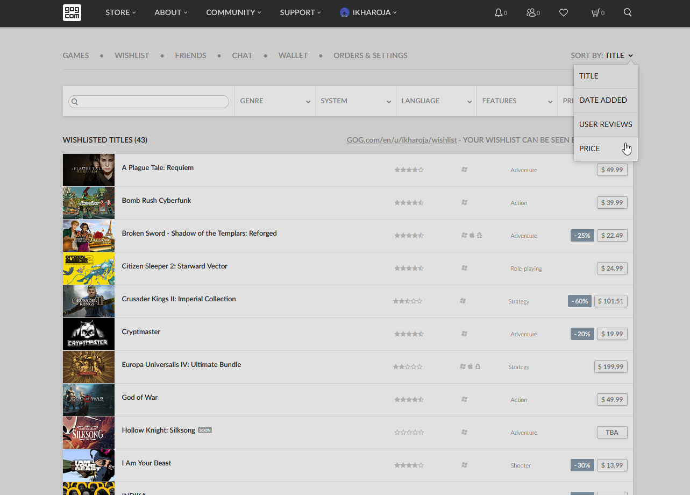

# GOG Wishlist - Sort by Price (Dropdown)

This userscript enables sorting by price (ascending and descending) via the dropdown on a GOG wishlist page. Switching between "sort by price" and a native sorting option (title, date added, user reviews) automatically refreshes the page twice.

## Preview

## Compatibility
This script has been tested with [Greasemonkey](https://addons.mozilla.org/en-US/firefox/addon/greasemonkey/), [Tampermonkey](https://addons.mozilla.org/en-US/firefox/addon/tampermonkey/) and [Violentmonkey](https://addons.mozilla.org/en-US/firefox/addon/violentmonkey/) on [Firefox](https://www.mozilla.org/en-US/firefox/new/) and should work with all modern browsers. 

## Installation
1. Install a ScriptManager for you browser.
    * **Firefox**: [Greasemonkey](https://addons.mozilla.org/en-US/firefox/addon/greasemonkey/), [Tampermonkey](https://addons.mozilla.org/en-US/firefox/addon/tampermonkey/) or [Violentmonkey](https://addons.mozilla.org/en-US/firefox/addon/violentmonkey/)
    * **Google Chrome** or **Vivaldi**: [Tampermonkey](https://chrome.google.com/webstore/detail/tampermonkey/dhdgffkkebhmkfjojejmpbldmpobfkfo) or [Violentmonkey](https://chrome.google.com/webstore/detail/violentmonkey/jinjaccalgkegednnccohejagnlnfdag)
2. Restart your browser if needed.
3. Click to install the script via [Github](https://github.com/idkicarus/GOG-Wishlist-Sort-by-Price/issues) or [Greasy Fork](https://greasyfork.org/en/scripts/526972-gog-wishlist-sort-by-price-dropdown).

## Issues
[Report an issue](https://github.com/idkicarus/GOG-Wishlist-Sort-by-Price/issues)

## License
[MIT](LICENSE)