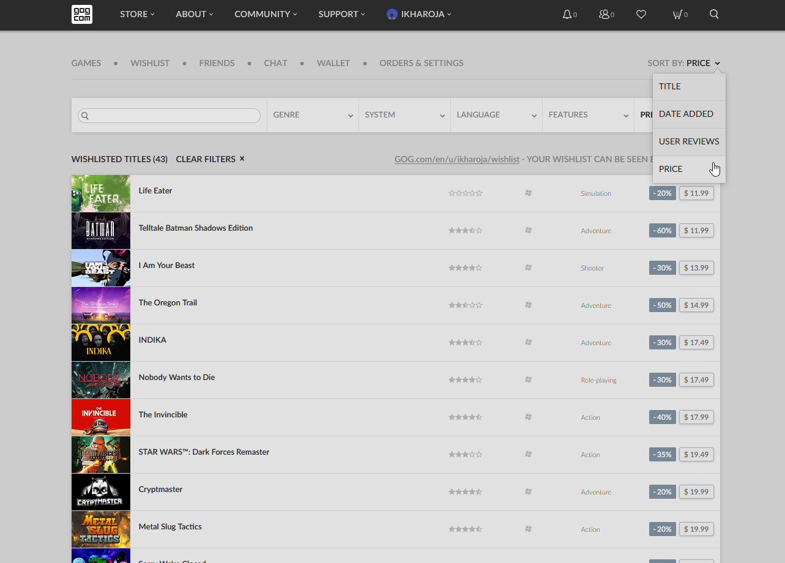
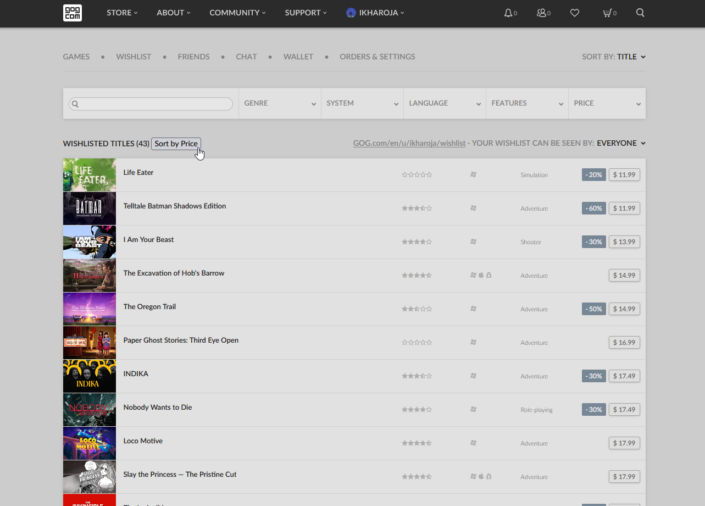

# GOG Wishlist - Sort by Price (Dropdown/Button)

These userscripts enable sorting by price (ascending and descending) via a dropdown/button on a GOG wishlist page. Switching between "sort by price" and a native sorting option (title, date added, user reviews) automatically refreshes the page twice.

## Screenshots

Preview of added dropdown entry.

Preview of added button.

## Compatibility
These userscripts has been tested with [Tampermonkey](https://addons.mozilla.org/en-US/firefox/addon/tampermonkey/) on [Firefox](https://www.mozilla.org/en-US/firefox/new/) and [Google Chrome](https://www.google.com/chrome/). However, they should also work with other script managers, like [Violentmonkey](https://addons.mozilla.org/en-US/firefox/addon/violentmonkey/), and with other modern browsers like Chrome or Vivaldi.

## Installation
1. Install a userscript manager for your browser.
    * **Firefox**: [Greasemonkey](https://addons.mozilla.org/en-US/firefox/addon/greasemonkey/), [Tampermonkey](https://addons.mozilla.org/en-US/firefox/addon/tampermonkey/) or [Violentmonkey](https://addons.mozilla.org/en-US/firefox/addon/violentmonkey/)
    * **Google Chrome** / **Vivaldi**: [Tampermonkey](https://chrome.google.com/webstore/detail/tampermonkey/dhdgffkkebhmkfjojejmpbldmpobfkfo) or [Violentmonkey](https://chrome.google.com/webstore/detail/violentmonkey/jinjaccalgkegednnccohejagnlnfdag)

2. If prompted, restart your browser.

3. Click to install your preferred script:
    * **Sort by Price (Dropdown)** via [Github](https://raw.githubusercontent.com/idkicarus/gog-wishlist-sort-by-price/main/gog-wishlist_sort-by-price_dropdown.user.js) or [Greasy Fork](https://greasyfork.org/en/scripts/526972-gog-wishlist-sort-by-price-dropdown).
    * **Sort by Price (Button)** via [Github](https://github.com/idkicarus/gog-wishlist-sort-by-price/raw/refs/heads/main/gog-wishlist_sort-by-price_button.user.js) or [Greasy Fork](https://greasyfork.org/en/scripts/527006-gog-wishlist-sort-by-price-button)

## Issues
[Report an issue](https://github.com/idkicarus/gog-wishlist-sort-by-price/issues)

## License
[MIT](LICENSE)